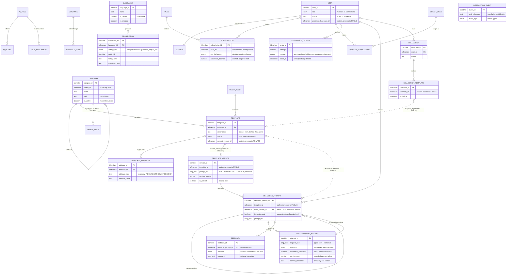

# 07 — MVP Persistent Data Definition

**Product:** AWA — AI Creation Guide Platform
**Sources of truth:** `docs/01-PROBLEM.md` … `docs/06-ARCHITECTURE-DECISION.md`
**Question this document answers:** What must the MVP persist, why, who owns it, which of the two databases it lives in, and who can reach it?
**Question it does not answer:** Which database technology. That belongs to a later stage.
**Status:** Revised against the 44-feature launch scope and the public/private database split

---

# Database Decision

**DATABASE: REQUIRED — as two separate databases, split by sensitivity.**

`06-ARCHITECTURE-DECISION.md §5` establishes the split and the reason for it:

| Database | Holds | Why separated |
|---|---|---|
| **Public** | Catalog content already shown to every visitor, unauthenticated, today | A leaked credential exposes category names and template descriptions — nothing that matters |
| **Private** | **The prompt text itself**, identity, money, and evidence | A leaked credential here would expose the paid product, accounts and payment data |

**The access rule is unconditional and identical for both stores:** neither database is ever reached directly by a client. Both are read and written only through the application server. `06 §5.0` states the principle this follows — the split is a blast-radius decision, not a new access pattern.

**One structural consequence worth stating before anything else:** `template` (public — name, description, status) and `template_version` (private — the prompt text) are now in different databases. `06 §5.3` treats the reference between them the same way this document already treats every content reference from evidence data: a recorded value, not an enforced foreign key.

**29 entities — 11 public, 18 private.** Every one is justified individually in §18, and nine candidates were rejected outright; three more moved from rejected to confirmed as the launch scope grew, and one (likes) is flagged as undecided rather than modelled.

---

# 1. Data Persistence Requirements

| Data | Why it must persist | Used by | Source | Database | Necessity |
|---|---|---|---|---|---|
| Category tree | Navigable structure, authored at runtime, unlimited depth | Everyone; administrators | FR-002, FR-037 / FEAT-002, 030 | Public | **Required** |
| Templates (metadata) | The catalog | Everyone; administrators | FR-038 / FEAT-031 | Public | **Required** |
| **Template attributes** | FEAT-004 narrows a list by recorded attributes | Filtering | FR-004 / FEAT-004 | Public | **Required** |
| **Prompt versions — the prompt text** | Prompts are revised; FEAT-033 requires history and reversion; **the paid product, kept private** | Administrators; attribution | FR-040 / FEAT-033 | **Private** | **Required** |
| AI tools and models | Recommendations and their reasoning | Everyone; administrators | FR-041 / FEAT-034 | Public | **Required** |
| Tool assignments | Which tools apply where, with inheritance | Recommendation resolution | FR-042 / FEAT-035 | Public | **Required** |
| Guidance and its steps | How to run the prompt on the tool | Everyone; administrators | FR-043 / FEAT-036 | Public | **Required** |
| Media references | Administrators upload at runtime | Everyone | FEAT-031, 036 | Public | **Required** |
| **Languages** | FEAT-039 — administrator-added, no release | Everyone | FR-046 / FEAT-039 | Public | **Required** |
| **Content translations** | FEAT-039 — per-language content with fallback | Everyone | FR-046 / FEAT-039 | Public | **Required** |
| Users | Access is a per-user decision | Everything gated | FR-047 / FEAT-022, 040 | Private | **Required** |
| Sessions | One active session per account | Every request | FR-029 / FEAT-025 | Private | **Required** |
| Plans and credit packs | What is sold | Purchase | FEAT-042 | Private | **Required** |
| Subscriptions | Entitlement, and its end date | Every prompt request | FR-026, FR-028 / FEAT-022, 024 | Private | **Required** |
| Payment transactions | Confirmation, idempotency, support | Purchase | FR-049 / FEAT-042 | Private | **Required** |
| Payment configuration | Administrator-managed, credentials write-only | Purchase | FR-049, NFR-005 / FEAT-042 | Private | **Required** |
| Allowance ledger | Money. Every change accounted for | Customization; disputes | FR-030–032, NFR-006 / FEAT-026 | Private | **Required** |
| Delivered prompts | What each user actually received | Attribution; lineage | FR-011, FR-040 / FEAT-010, 013 | Private | **Required** |
| Customization attempts | Cost is incurred even when nothing is delivered | Cost control; FEAT-015 | FR-015, FR-050 / FEAT-013, 043 | Private | **Required** |
| Spend per period | The cap is enforced against a running total | Every paid call | FR-050 / FEAT-043 | Private | **Required** |
| Feedback | The only quality signal | The team | FR-035 / FEAT-028 | Private | **Required** |
| Unmet needs | Demand for content that does not exist | The team | FR-007 / FEAT-007 | Private | **Required** |
| Interaction events | Conversion, departure, and what feedback misses | The team | `05-MVP §10` | Private | **Required** |
| Audit records | FEAT-041 grants things with monetary value | Accountability | NFR-016 / FEAT-041 | Private | **Required** |
| **Collections** | FEAT-009 — a user's named, private groupings of saved templates | The user | FR-010 / FEAT-009 | Private | **Required** |
| Voice recordings | — | — | FEAT-014 excluded | — | **Does not exist** |
| Guided input fields | — | — | Replaced by AI customization (FEAT-013) | — | **Not persisted** |
| Likes | Genuinely undecided — see §19.1 | — | No FEAT identifier; not in `05-MVP`'s scope decision | — | **REQUIRES PRODUCT DECISION** |

---

# 2. Persistent, Temporary and Derived

## 2.1 Persistent

Everything in §1 marked Required. All of it outlives the interaction that created it.

## 2.2 Session or temporary

| Data | Why it does not persist |
|---|---|
| Current navigation position | Meaningless once the visitor leaves |
| Unsubmitted change-request text | Held by the interface. NFR-012 requires it survive interruption, which is an interface responsibility, not a stored one |
| The concealed-prompt state | Derived from entitlement at request time |
| The selected display language | A session preference, re-selectable at any time; not a fact about the user worth persisting at launch |

## 2.3 Derived, not stored

| Derived | From | Why not stored |
|---|---|---|
| **Content gaps** (FEAT-038) | Templates without assignments, guidance or prompts; unmet-need records | Computing on read is always current. A stored copy would go stale the moment a gap is fixed |
| **Effective tool recommendation** | Assignments plus the node's ancestors | Inheritance means the answer changes when a parent changes. Storing the resolved set would need invalidating on every tree edit |
| **Effective guidance** | The same inheritance walk | Same |
| **Effective translated content** | The requested language, falling back to the default when a translation is absent | Resolved on read from `translation`; a stored per-language copy of every field would need invalidating on every content edit |
| **Search and filter results** | Indexed queries over `template.name`, `template.description`, and `template_attribute` | `06 §13` — a 20–30 template catalog needs no dedicated index; the query runs directly against the public database |
| **Allowance balance** | The ledger | Held as a cached figure for display (§6.14), but **the ledger is the truth**. If they disagree, the ledger wins |
| **Whether a subscription is active** | End date compared to now | `06 §12` — a comparison, not a job. Nothing needs to run |
| Reporting aggregates (FEAT-044) | Events, feedback, costs | `06 §12` — computed on read at launch volume |

---

# 3. Entity Map

```
PUBLIC DATABASE (administrator-owned, no entitlement check, reachable by everyone)
  category ──┬── category                    (self-referencing, unlimited depth)
             ├── template ── template_attribute
             │       │
             │       └── current_version_id ─ ─ ─ ─ ┐  (soft reference,
             ├── tool_assignment ── ai_tool ── ai_model                  crosses into
             └── guidance ── guidance_step                              the PRIVATE
  media_asset                                                            database)
  language ── translation                     (attaches to category / template /
                                                guidance_step / ai_tool fields)

PRIVATE DATABASE (entitlement- and identity-gated; money; the prompt itself)
  template_version  ← ← ← ← ← ← ← ← ← ← ← ← ← ┘  (the prompt text — referenced
        │                                          FROM the public database,
        │                                          never the reverse)
        └── delivered_prompt
                └── delivered_prompt          (customization lineage)

  user ──┬── session                          (one active)
         ├── subscription ── plan
         ├── allowance_ledger                 (append-only; balance derived)
         ├── payment_transaction ── credit_pack
         └── collection ── collection_template ─ ─ ─▶ template   (soft reference,
  payment_configuration                                            crosses into
                                                                    the PUBLIC
  customization_attempt ── delivered_prompt   (nullable — failures deliver nothing)  database)
  feedback ── delivered_prompt
  unmet_need ─ ─ ─▶ category                  (soft reference, crosses into PUBLIC)
  interaction_event ─ ─ ─▶ category / template / tool_id   (soft references)
  spend_period
  audit_log
```

---

# 4. Public Database — Catalog Content

Holds only what every visitor already sees for free, unauthenticated, today. No row in this database requires knowing who is asking.

## 4.1 `category`

**Purpose:** A node in the catalog tree — a category or a subcategory at any depth.
**Why it exists:** FEAT-030 requires administrators to build and reshape the catalog at runtime, to any depth, with the same process at every level.
**Traceability:** FR-002, FR-037 / FEAT-002, FEAT-030
**Ownership:** Administrative. **Lifecycle:** Created and reshaped by administrators; hidden rather than deleted where it contains anything (FEAT-030).

| Field | Purpose | Required | Type | Notes |
|---|---|---|---|---|
| `category_id` | Identity | Yes | Identifier | Primary |
| `parent_id` | Tree position | No | Reference | Null at top level |
| `name`, `description` | Presentation, in the default language | Name yes | Text | Per-language variants in `translation` (§4.9) |
| `position` | Order among siblings | Yes | Number | FEAT-030 reordering |
| `is_visible` | Whether users see it | Yes | Boolean | Hiding applies to the whole subtree |
| `preview_media_id` | Card image | No | Reference | |
| `path`, `depth` | Materialised tree position | Yes | Text, Number | **[ASSUMPTION]** — makes ancestor and subtree resolution one operation instead of a walk. Rebuilt when a node moves |

**Constraint:** a node cannot be moved beneath its own descendant.

## 4.2 `template`

**Purpose:** One catalog entry for one specific job — **everything about it except the prompt itself.**
**Why it exists:** Templates are the catalog (FEAT-031).
**Traceability:** FR-038 / FEAT-031, FEAT-008
**Ownership:** Administrative. **Lifecycle:** Draft → published → hidden. Cannot be published without a prompt version.

| Field | Purpose | Required | Type | Notes |
|---|---|---|---|---|
| `template_id` | Identity | Yes | Identifier | |
| `category_id` | Where it sits | Yes | Reference | Any depth |
| `name` | Identification, default language | Yes | Text | |
| `description` | **What it produces**, default language | Yes | Text | FEAT-008 — the user chooses from this alone, behind the paywall |
| `preview_media_id` | Card image | No | Reference | |
| `status` | Draft, published, hidden | Yes | Enum | Publishing requires a current version |
| `current_version_id` | **The prompt in force** | No | **Reference into the private database** | **Crosses the database boundary — §8.1.** Null while draft |
| `position` | Order within the node | Yes | Number | |

**The prompt text is not a field here.** It never was, structurally — but it now also sits in a different database entirely. `current_version_id` names which private-database row is current; the text itself is never read, cached, or duplicated into this store.

## 4.3 `template_attribute`

**Purpose:** A recorded attribute on a template, for filtering.
**Why it exists:** FEAT-004 — "narrows a template list by the attributes recorded against templates." Previously excluded because filtering was excluded; **now required because filtering is in launch scope.**
**Traceability:** FR-004 / FEAT-004
**Ownership:** Administrative.

| Field | Purpose | Required | Type | Notes |
|---|---|---|---|---|
| `attribute_id` | Identity | Yes | Identifier | |
| `template_id` | Which template | Yes | Reference | |
| `attribute_type` | The kind of attribute | Yes | Text | **REQUIRES PRODUCT DECISION** — see below |
| `attribute_value` | The value | Yes | Text | |

**Deliberately generic, not a fixed set of columns.** `03-REQUIREMENTS.md` and `04-FEATURES.md` confirm that filtering exists but never name the attributes a template is filtered by — style, orientation, mood, and format are all plausible, none is specified. A flexible type/value pair lets administrators tag templates without the schema anticipating a taxonomy nobody has written down.

**REQUIRES PRODUCT DECISION: the actual set of `attribute_type` values users will filter by.** Nothing in `01–06` determines this, and inventing a taxonomy here would be exactly the kind of speculative content the previous revision of this document warned against.

## 4.4 `ai_tool` and `ai_model`

**Purpose:** The external tools recommended to users, and their model variants.
**Why it exists:** FEAT-034 — tools change constantly and the list must be maintained at runtime.
**Traceability:** FR-041 / FEAT-034, FEAT-016
**Ownership:** Administrative. **Lifecycle:** Added, edited, withdrawn. Withdrawal removes them from recommendations; existing references stay readable.

`ai_tool`: `tool_id` · `name` · `destination` (where the user is sent) · `reasoning` (the line shown to users, default language) · `pricing_note` · `quality_note` · `logo_media_id` · `is_available`

`ai_model`: `model_id` · `tool_id` · `name` · `is_available`

**`reasoning` is not decoration.** FEAT-016 requires every recommendation to carry a reason; it is what makes the recommendation a choice rather than an instruction.

## 4.5 `tool_assignment`

**Purpose:** Which tool or model is recommended at which point in the catalog.
**Why it exists:** FEAT-035 — assigning per template would not scale and would drift. Assignment at a node applies to everything beneath unless overridden.
**Traceability:** FR-042 / FEAT-035, FEAT-016
**Ownership:** Administrative.

`assignment_id` · `scope_type` (category or template) · `scope_id` · `tool_id` · `model_id` (optional) · `position` · `reasoning_override` (optional) · `is_active`

**Unique on** (scope_type, scope_id, tool_id, model_id).

**The resolved recommendation is derived, never stored** (§2.3). Inheritance means the answer changes whenever an ancestor changes. **This scope_type/scope_id pattern is reused deliberately for `guidance` (§4.6) and `translation` (§4.9)** — one polymorphic-scope mechanism, applied consistently, rather than three bespoke ones.

## 4.6 `guidance` and `guidance_step`

**Purpose:** The short walkthrough for running a prompt on a tool.
**Why it exists:** FEAT-036, with the same inheritance behaviour as tool assignment.
**Traceability:** FR-043 / FEAT-020, FEAT-036
**Ownership:** Administrative.

`guidance`: `guidance_id` · `scope_type` · `scope_id` · `presentation` (written, recorded, both) · `media_id` (optional) · `is_active`. Unique on (scope_type, scope_id).

`guidance_step`: `step_id` · `guidance_id` · `position` · `instruction` (default language)

## 4.7 `media_asset`

**Purpose:** A reference to something an administrator uploaded.
**Why it exists:** `06 §13` — administrators upload previews and recorded guidance at runtime, so the reference must be stored even though the file itself is not.
**Traceability:** FEAT-031, FEAT-036
**Ownership:** Administrative. **Lifecycle:** Created on upload; dereferenced rather than deleted immediately, so a reversion can still resolve.

`media_id` · `storage_reference` · `kind` · `original_filename` · `size` · `uploaded_by` · `uploaded_at`

## 4.8 `language`

**Purpose:** A language the interface and catalog can be presented in.
**Why it exists:** FEAT-039 — "administrators able to add languages and translations, without a software release." Previously excluded; **now required.**
**Traceability:** FR-046 / FEAT-039
**Ownership:** Administrative. **Lifecycle:** Added and enabled by an administrator; disabling hides it from selection without deleting existing translations.

`language_id` (a code, e.g. `en`, `ml`) · `name` · `is_default` · `is_enabled`

**Exactly one language has `is_default = true`.** It is the fallback FEAT-039 requires when a translation is absent, and the language every field's base value (§4.1–4.6) is written in.

## 4.9 `translation`

**Purpose:** A per-language override of one field on one piece of content.
**Why it exists:** FEAT-039's acceptance criteria require a defined fallback and forbid any untranslated placeholder ever reaching a user. A generic attachment point covers every translatable field without a table per entity type.
**Traceability:** FR-046 / FEAT-039
**Ownership:** Administrative.

`translation_id` · `language_id` · `entity_type` (category, template, guidance_step, ai_tool) · `entity_id` · `field_name` (e.g. `name`, `description`, `instruction`, `reasoning`) · `translated_text`

**Unique on** (language_id, entity_type, entity_id, field_name).

**Resolution rule, and it is absolute:** read the row for the requested language; if none exists, read the entity's own field, which is always written in the default language (§4.8) and therefore always present. **This is what makes "no untranslated placeholder ever visible" achievable by construction** — there is always a value to fall back to, because the base field is never itself in a language that might be missing.

**What this deliberately does not cover: interface chrome.** Button labels, section headers, and other fixed UI text are not administered content — nothing in `01–06` describes them as data an administrator edits at runtime, and FEAT-039's own description is about the *catalog* being multilingual, not the interface skeleton. Standard static language files, shipped with a release, are the ordinary way to handle interface strings, and inventing a database-driven mechanism for them here would be scope FEAT-039 never asked for. **If runtime-editable interface chrome is wanted, that is a REQUIRES PRODUCT DECISION, not a gap in this model.**

---

# 5. Private Database — The Prompt, Identity, Commerce and Evidence

## 5.1 `template_version`

**Purpose:** One saved state of a template's prompt — **the paid product itself.**
**Why it exists:** `P-§15` establishes that prompts decay as models change, so they will be revised repeatedly. FEAT-033 requires history and reversion, `P-§20` makes "did the revision help?" a success measure, and `06 §5.2` places the text here specifically because it is the one thing the public/private split exists to protect.
**Traceability:** FR-040 / FEAT-032, FEAT-033
**Ownership:** Administrative. **Lifecycle:** **Append-only.** Reverting inserts a new version whose content equals an older one; no version is ever edited or removed.

| Field | Purpose | Required | Type | Notes |
|---|---|---|---|---|
| `version_id` | Identity | Yes | Identifier | **Referenced by every delivered prompt — same database, a real foreign key** |
| `template_id` | Which template | Yes | **Reference into the public database** | Crosses the boundary — §8.1 |
| `version_number` | Ordering | Yes | Number | Unique per template |
| `prompt_text` | The prompt | Yes | Long text | **The product. Never in the public database, under any circumstance** |
| `change_note` | Why it changed | No | Text | |
| `authored_by` | Attribution | Yes | Reference | |
| `is_current` | In force | Yes | Boolean | **Exactly one per template.** The public database's `template.current_version_id` points here |
| `created_at` | When | Yes | Date/time | Relates feedback to what was live |

**Publishing a new version, or reverting to an old one, is the one operation in the whole model that writes to both databases** (`06 §5.4`): insert this row first, then update the public `template.current_version_id` to point at it. Never the reverse order.

## 5.2 `user`

**Purpose:** An account.
**Why it exists:** FEAT-022 makes prompt access a per-user decision; there is no way to make it without identity.
**Traceability:** FR-047 / FEAT-022, FEAT-040
**Ownership:** Shared — the person's own record, administered by the platform.
**Lifecycle:** Created at sign-up; suspended or restored by an administrator (FEAT-040).

`user_id` · `email` (unique) · `display_name` (optional) · `role` (member or administrator) · `status` (active or suspended) · `preferred_language_id` (optional reference to `language`, in the public database — a soft reference, same treatment as §8.1) · `created_at` · `last_seen_at`

**Two roles only.** `03-REQUIREMENTS.md` OD-08 leaves finer-grained administrative roles open, and `06 §17.5` A4 assumes administrators are few and trusted. Adding roles nobody has asked for would be inventing a permission model.

## 5.3 `session`

**Purpose:** The one session an account may have active.
**Why it exists:** FEAT-025 requires a new sign-in to end the previous session. That needs the current session to be identifiable and revocable — a stronger requirement than sign-in alone (`06 §10.1`).
**Traceability:** FR-029 / FEAT-025
**Ownership:** Platform. **Lifecycle:** Created at sign-in; superseded by the next sign-in.

`session_id` · `user_id` · `started_at` · `last_seen_at` · `ended_at` (nullable) · `ended_reason`

**Constraint:** at most one session per user without `ended_at`. `ended_reason` exists so FEAT-025 can tell the displaced user *why*, rather than returning them silently to sign-in.

## 5.4 `plan` and `credit_pack`

**Purpose:** What is sold.
**Why it exists:** `05-MVP §3.3` lists plan and credit pack definitions as content the platform must supply.
**Traceability:** FEAT-042, FEAT-026, FEAT-027
**Ownership:** Administrative.

`plan`: `plan_id` · `name` · `description` · `price` · `currency` · `term_length` · `initial_allowance` · `is_available`
`credit_pack`: `pack_id` · `name` · `price` · `currency` · `units` · `is_available`

**Kept separate** because they behave differently: a plan grants access for a term and issues an initial allowance; a pack grants units once and confers no access.

**Held in the private database despite `GET /plans` being unauthenticated.** Being privately stored does not stop the application server from answering a public pricing request — it only means the credential guarding this data is never the same one that guards the catalog. Plans are grouped with payment configuration because they are administered and written together (`06 §5.2`).

## 5.5 `subscription`

**Purpose:** Whether this person may read prompts, and until when.
**Why it exists:** Consulted on every request that could return prompt text.
**Traceability:** FR-026, FR-028 / FEAT-022, FEAT-024
**Ownership:** Shared. **Lifecycle:** Created on payment confirmation; ends at term end per the decided behaviour.

| Field | Purpose | Required | Notes |
|---|---|---|---|
| `subscription_id` | Identity | Yes | |
| `user_id` | Whose | Yes | |
| `plan_id` | What was bought | Yes | |
| `state` | Active, ended, cancelled | Yes | |
| `started_at` | Term start | Yes | |
| `ends_at` | **Term end** | Yes | Entitlement is a comparison against this. `06 §12` — no scheduled job needed |
| `end_behaviour` | What applies at term end | Yes | **Decided: `retain_delivered`** (`05-MVP §3.3`) — prompts already delivered remain readable; no new deliveries or customizations. Recorded per subscription so a later policy change cannot alter existing terms |
| `allowance_balance` | Cached figure for display | Yes | **Derived from the ledger. The ledger is the truth** |

## 5.6 `payment_transaction`

**Purpose:** A record of money moving.
**Why it exists:** Confirmation arrives from the provider, and `06 §9.1` requires processing to be idempotent — which needs the provider's own reference stored.
**Traceability:** FR-049 / FEAT-042
**Ownership:** Platform. **Lifecycle:** Append-only.

`transaction_id` · `user_id` · `purchase_type` (plan or pack) · `purchase_id` · `provider_reference` (**unique**) · `amount` · `currency` · `state` · `occurred_at`

**The unique constraint on `provider_reference` is what makes duplicate confirmations harmless.** A provider that delivers the same confirmation twice must not grant two subscriptions.

**No card details are stored.** Checkout is provider-hosted (`06 §9.1`).

## 5.7 `payment_configuration`

**Purpose:** How payment is taken, configured by an administrator.
**Traceability:** FR-049, NFR-005 / FEAT-042
**Ownership:** Administrative.

`configuration_id` · `provider` · `mode` (test or live) · `credentials` (**encrypted, write-only**) · `is_enabled` · `last_verified_at`

**NFR-005 requires credentials be unretrievable after being set** — not returned by any read, and absent from operational records. `last_verified_at` supports FEAT-042's requirement that a configuration be verified before live use.

---

# 6. Usage and Evidence Entities

## 6.1 `delivered_prompt`

**Purpose:** The prompt text a specific user actually received.
**Why it exists:** **This entity is what makes attribution survive customization.** Without it, feedback on a customized prompt would be recorded against the base version, and base-prompt quality measurement would silently contaminate — an administrator comparing version 4 with version 3 would be comparing two mixtures.
**Traceability:** FR-011, FR-015, FR-040 / FEAT-010, FEAT-013, FEAT-033
**Ownership:** Shared. **Lifecycle:** Append-only. A customization creates a new row; nothing is updated.

| Field | Purpose | Required | Notes |
|---|---|---|---|
| `delivered_prompt_id` | Identity | Yes | What feedback attaches to |
| `user_id` | Who received it | Yes | |
| `template_id` | Which template | Yes | **Reference into the public database** — crosses the boundary, §8.1 |
| `base_version_id` | **Which prompt version it derives from** | Yes | Same database as this row — a real foreign key to `template_version` |
| `prompt_text` | What they actually got | Yes | For a base delivery, equal to the version text; for a customization, the revised text |
| `is_customized` | Base or derived | Yes | **Separates base-prompt quality from customization quality in every later analysis** |
| `parent_delivered_prompt_id` | Customization lineage | No | Set when a customization builds on a previous one |
| `delivered_at` | When | Yes | |

**Why the base text is stored rather than only referenced:** a base delivery could resolve `base_version_id` to read its text, since both now live in the same private database. The text is stored anyway because a customized prompt has no version to resolve to, and having one shape for both is simpler than two. **[ASSUMPTION]** — trades a little duplication for uniformity.

## 6.2 `customization_attempt`

**Purpose:** Every attempt to customize a prompt, whether or not it produced one.
**Why it exists:** `09 §4.3` establishes an asymmetry that this entity is the only way to see: **for anything detectable only after the call, the money is already spent when we learn the request was unusable.** FEAT-015 means the user is not charged. The business still is. Failed attempts must be recorded or the cost is invisible.
**Traceability:** FR-015, FR-017, FR-018, FR-050 / FEAT-013, FEAT-015, FEAT-043
**Ownership:** Shared. **Lifecycle:** Append-only.

| Field | Purpose | Required | Notes |
|---|---|---|---|
| `attempt_id` | Identity | Yes | |
| `user_id` | Who | Yes | |
| `source_delivered_prompt_id` | What was being changed | Yes | |
| `request_text` | The described change | Yes | Typed only — FEAT-014 excluded, so no transcription ever produces this text. **Potentially sensitive — §16** |
| `outcome` | Succeeded, unusable, failed | Yes | Distinguishes the three cases FEAT-015 treats differently |
| `resulting_delivered_prompt_id` | What was produced | No | **Null when the attempt failed** |
| `allowance_consumed` | Whether a unit was taken | Yes | Should be false whenever outcome is not success — auditable evidence that FEAT-015 works |
| `service_cost` | What it cost | No | Feeds the cap and the reporting |
| `service_reference` | Which capability and version produced it | No | Without it, comparing quality across a silent model change produces numbers that lie (`09 §4.6`) |
| `attempted_at` | When | Yes | |

**No `input_mode` field.** The previous revision of this model distinguished typed from spoken input because FEAT-014 was in scope. It no longer is (`05-MVP §11`): every request is typed, so a field distinguishing input modes would record a constant and answer a question nobody is asking. If FEAT-014 returns, this field returns with it (`06 §17.6`).

**No audio is stored, because none is ever collected.** NFR-004's deletion requirement does not apply at launch — there is nothing to delete.

## 6.3 `allowance_ledger`

**Purpose:** Every change to a user's customization allowance, with its cause.
**Why it exists:** Allowance is bought with money. NFR-006 requires a dispute to be answerable precisely, not approximately.
**Traceability:** FR-030–032, NFR-006 / FEAT-026
**Ownership:** Shared. **Lifecycle:** **Append-only. Nothing is ever updated.**

`entry_id` · `user_id` · `change` (positive or negative) · `reason` (initial grant, purchase, hold, consume, release, support adjustment) · `related_attempt_id` (optional) · `related_transaction_id` (optional) · `actor_id` (for support adjustments) · `occurred_at`

**Three properties that matter:**

**Hold, consume and release are separate entries.** A unit is reserved before the call, then either consumed or released. `09 §4.3` explains why: deducting first charges for failures; deducting after lets two concurrent requests spend the same unit.

**The balance on `subscription` is a cached figure.** If it disagrees with the ledger, the ledger wins.

**Support adjustments are entries like any other**, carrying `actor_id`. FEAT-041 lets an administrator grant allowance — a thing with monetary value — and it must be attributable.

## 6.4 `spend_period`

**Purpose:** The running total the expenditure cap is enforced against.
**Why it exists:** `06 §12` — the cap is checked before every paid call, and a running total updated in the same transaction avoids a scheduled job.
**Traceability:** FR-050 / FEAT-043
**Ownership:** Platform.

`period_id` · `period_start` · `period_end` · `limit` · `spent` · `notified_at`

**Derivable from `customization_attempt`**, and held separately only because it is read before every paid call. `notified_at` supports FEAT-043's requirement that administrators be warned before the cap is reached, not after.

## 6.5 `feedback`

**Purpose:** Whether the prompt worked.
**Why it exists:** `P-§15` — AWA cannot observe what the external tool produced. Self-report is the only quality signal available.
**Traceability:** FR-035, FR-040 / FEAT-028
**Ownership:** Shared. **Lifecycle:** Append-only.

`feedback_id` · `delivered_prompt_id` (**not the template version** — see below) · `user_id` · `outcome` · `comment` (optional) · `submitted_at`

**Attaching to `delivered_prompt` rather than to `template_version` is the single most important relationship in this model.** The delivered prompt carries `base_version_id` and `is_customized`, so both questions remain answerable:

- *Did version 4 of this prompt perform better than version 3?* — filter to `is_customized = false`
- *Does customization improve outcomes?* — compare across the flag

Attaching feedback directly to the version would collapse both into one contaminated number.

**The outcome scale is decided: two values, worked / did not work** (`05-MVP §3.3`). A free-text comment is optional and appears after the choice.

## 6.6 `unmet_need`

**Purpose:** What someone wanted when nothing in the catalog fitted.
**Why it exists:** `05-MVP §6.1` — demand stated by a user for content that does not exist. `05-MVP §10.3` uses whether these cluster or scatter as a validation criterion.
**Traceability:** FR-007, FR-045 / FEAT-007, FEAT-038
**Ownership:** Shared. **Lifecycle:** Append-only.

`unmet_need_id` · `user_id` (optional — a visitor may report before subscribing) · `category_id` (**reference into the public database** — where they were, crosses the boundary) · `description` (**required**) · `submitted_at`

**Both fields matter.** A description with no position cannot be acted on; a position with no description carries nothing.

## 6.7 `interaction_event`

**Purpose:** That someone reached a defined point in the journey.
**Why it exists:** Feedback captures only volunteers. `05-MVP §6.1 F2` records the conversion moment — someone who sees the concealed prompt and does not subscribe — as the single most important untested moment in the product, and no one reports that voluntarily.
**Traceability:** `05-MVP §10.1`, `§10.4` / supports FEAT-028's interpretation
**Ownership:** Platform. **Lifecycle:** Append-only.

`event_id` · `visit_reference` · `user_id` (optional) · `event_type` · `category_id` (optional, **reference into the public database**) · `template_id` (optional, **reference into the public database**) · `delivered_prompt_id` (optional, same database) · `tool_id` (optional, **reference into the public database**) · `occurred_at`

**The event set**, derived from `05-MVP §10`:

| Event | Answers |
|---|---|
| Template viewed | Did they reach a specific job? |
| **Searched or filtered** | **New** — is the discovery feature used at all (`05-MVP` V-I9)? |
| **Concealed prompt shown** | **The conversion denominator** |
| Subscribed | The conversion numerator |
| Prompt delivered | Did they receive the product? |
| Customization requested | Is the capability used? |
| Prompt taken | Did they judge it worth using? |
| Saved to a collection | **New** — is FEAT-009 used, and does a saver return (`05-MVP` V-I10)? |
| Departed to tool | Did they act on the recommendation? |
| Returned after departure | Basis for the return signal |
| No match reached | How often nothing fitted, including when nobody described it |
| Language changed | **New** — is a non-default language actually selected? |

**`visit_reference` is a correlation value, not identity** (`06 §10.1`). It groups a visitor's events before they have an account. Once they subscribe, `user_id` carries the link.

**Deliberately not captured:** page views, scroll depth, time on page, device details. None answers a question in `05-MVP §10`.

## 6.8 `audit_log`

**Purpose:** Who did what to a record that matters.
**Why it exists:** FEAT-041 lets administrators grant access and allowance — things with monetary value. NFR-016 requires attribution.
**Traceability:** NFR-016 / FEAT-041, FEAT-040
**Ownership:** Platform. **Lifecycle:** Append-only, and **not alterable by the actor who created the entry**.

`audit_id` · `actor_id` · `action` · `entity_type` · `entity_id` · `before` · `after` · `occurred_at`

**Covers:** content publishing and reversion (across both databases — §5.1), user role and status changes, support adjustments to access or allowance, and payment configuration changes.

## 6.9 `collection`

**Purpose:** A user-created, named, private grouping of saved templates.
**Why it exists:** FEAT-009, merged with the Collections feature (`features.md §4.5`). `UR-§4.6` — returning to something useful without searching again.
**Traceability:** FR-010 / FEAT-009
**Ownership:** User-owned. **Lifecycle:** Created, renamed and deleted by the owner. Deleting a collection removes the list, not the templates.

`collection_id` · `user_id` · `name` · `created_at`

**No subscription required.** A user can create collections and save templates to them without ever subscribing (`features.md`) — this is deliberate, giving a visitor a reason to create an account before they are ready to pay.

## 6.10 `collection_template`

**Purpose:** Which templates sit in which collections.
**Why it exists:** `features.md §4.5` — "one template can be in several collections." A many-to-many join, not a field on either side.
**Traceability:** FR-010 / FEAT-009
**Ownership:** User-owned.

`collection_id` · `template_id` (**reference into the public database** — crosses the boundary) · `added_at`

**Unique on** (collection_id, template_id) — saving the same template to the same collection twice leaves one row.

**If the referenced template is later hidden or withdrawn, this row is not deleted.** `features.md` requires the collection to show the template as unavailable with a short explanation, not silently drop it — the row persists; the application layer checks the template's current status at read time.

---
# 7. Primary Identifiers

| Entity | Database | Identifier |
|---|---|---|
| category | Public | `category_id` |
| template | Public | `template_id` |
| template_attribute | Public | `attribute_id` |
| ai_tool | Public | `tool_id` |
| ai_model | Public | `model_id` |
| tool_assignment | Public | `assignment_id` |
| guidance | Public | `guidance_id` |
| guidance_step | Public | `step_id` |
| media_asset | Public | `media_id` |
| language | Public | `language_id` |
| translation | Public | `translation_id` |
| **template_version** | **Private** | `version_id` |
| user | Private | `user_id` |
| session | Private | `session_id` |
| plan / credit_pack | Private | `plan_id` / `pack_id` |
| subscription | Private | `subscription_id` |
| payment_transaction | Private | `transaction_id` |
| payment_configuration | Private | `configuration_id` |
| delivered_prompt | Private | `delivered_prompt_id` |
| customization_attempt | Private | `attempt_id` |
| allowance_ledger | Private | `entry_id` |
| spend_period | Private | `period_id` |
| feedback | Private | `feedback_id` |
| unmet_need | Private | `unmet_need_id` |
| interaction_event | Private | `event_id` |
| audit_log | Private | `audit_id` |
| collection | Private | `collection_id` |
| collection_template | Private | (collection_id, template_id) |

No implementation format is prescribed.

## 7.1 Identifier stability now has two dimensions

The previous scope held content outside any store, and identifier stability was the most fragile point in the model — a renamed file could silently break attribution with no error anywhere.

**That fragility inside a single store is gone**, but the split reintroduces a version of it across two stores: `template.current_version_id`, `delivered_prompt.template_id`, `unmet_need.category_id`, `collection_template.template_id`, and the `interaction_event` references all point across the database boundary, where no engine-level constraint can catch a dangling reference.

**The discipline this requires:** identifiers must be stable across both databases, and nothing but care enforces that. A periodic consistency check — do all public-referenced private IDs still exist, and vice versa — is worth having before launch, not after. This extends the existing rule in §17 V4 (administrators must increment a version when they change a prompt's text) to a second, structural risk: **the two stores can drift apart, and only a verification job would notice.**

---

# 8. Relationships

## 8.1 Cross-database references — no enforced constraint

| From (database) | Field | To (database) | Direction |
|---|---|---|---|
| `template.current_version_id` | Public → Private | `template_version.version_id` | **The only public-to-private reference in the model** |
| `delivered_prompt.template_id` | Private → Public | `template.template_id` | |
| `unmet_need.category_id` | Private → Public | `category.category_id` | |
| `interaction_event.category_id / template_id / tool_id` | Private → Public | `category` / `template` / `ai_tool` | |
| `collection_template.template_id` | Private → Public | `template.template_id` | |
| `user.preferred_language_id` | Private → Public | `language.language_id` | |

**Every row above is a recorded value, not a foreign key.** Neither database engine can enforce referential integrity across the boundary. §7.1 names the resulting discipline.

## 8.2 Within-database relationships

| A | B | Relationship | Cardinality | Why required |
|---|---|---|---|---|
| category | category | Parent of | 1 → many | Unlimited depth (FEAT-002, 030) |
| category | template | Contains | 1 → many | Templates sit at any depth |
| template | template_attribute | Tagged with | 1 → many | FEAT-004 |
| category / template | tool_assignment | Scoped to | 1 → many | Inheritance (FEAT-035) |
| ai_tool | ai_model | Offers | 1 → many | FEAT-034 |
| tool_assignment | ai_tool / ai_model | Recommends | many → 1 | FEAT-016 |
| category / template | guidance | Scoped to | 1 → 0..1 | FEAT-036 |
| guidance | guidance_step | Ordered steps | 1 → many | FEAT-020 |
| language | translation | Provides | 1 → many | FEAT-039 |
| **template_version** | **delivered_prompt** | **Produced** | **1 → many** | **The attribution anchor — same database, a real foreign key** |
| user | session | Has | 1 → **0..1 active** | FEAT-025 |
| user | subscription | Holds | 1 → many over time, **0..1 active** | FEAT-022, 024 |
| plan | subscription | Sold as | 1 → many | FEAT-042 |
| user | allowance_ledger | Accrues | 1 → many | FEAT-026 |
| user | payment_transaction | Makes | 1 → many | FEAT-042 |
| user | delivered_prompt | Receives | 1 → many | FEAT-010 |
| delivered_prompt | delivered_prompt | Customized from | 1 → many | Customization lineage (FEAT-013) |
| delivered_prompt | customization_attempt | Was the source of | 1 → many | FEAT-013 |
| customization_attempt | delivered_prompt | Produced | 1 → **0..1** | **Null on failure — the cost still happened** |
| delivered_prompt | feedback | Rated by | 1 → many | FEAT-028 |
| user | collection | Owns | 1 → many | FEAT-009 |
| collection | collection_template | Contains | 1 → many | A template may be in several |

**The relationship that carries the most weight** is `template_version → delivered_prompt`. Everything about measuring whether a prompt revision helped depends on it, and `delivered_prompt.is_customized` is what keeps base-prompt quality separable from customization quality. **It is now a same-database relationship** — the split moved `template_version` into the private database alongside `delivered_prompt`, which is why this particular reference needs no special treatment despite the boundary existing elsewhere.

---

# 9. Data Ownership

| Entity group | Database | Ownership | Create | Read | Update | Delete |
|---|---|---|---|---|---|---|
| Category, template, tool, assignment, guidance, media, language, translation | Public | **Administrative** | Administrator | Everyone, filtered by visibility | Administrator; versions never | Hidden, not deleted |
| template_version | **Private** | Administrative | Administrator | **Application layer only, subject to entitlement** | **Never** | **Never** |
| user | Private | **Shared** | The person, at sign-up | Themselves; administrators | Themselves (limited); administrators (role, status) | Not during launch |
| session | Private | Platform | System, at sign-in | System | Ended, not edited | Superseded |
| plan, credit_pack, payment_configuration | Private | **Administrative** | Administrator | Administrator; public fields on plans, served via the application layer | Administrator | Withdrawn, not deleted |
| subscription, payment_transaction | Private | **Shared** | System, on confirmation | Owner; administrators | State only | Never |
| allowance_ledger | Private | **Shared** | System; administrators for support entries | Owner (as a balance); administrators | **Never** | **Never** |
| delivered_prompt, customization_attempt | Private | **Shared** | System, on the user's action | Owner; the team | **Never** | Not during launch |
| feedback, unmet_need | Private | **Shared** | The person | The team | **Never** | Not during launch |
| interaction_event, spend_period, audit_log | Private | **Platform** | System | The team | **Never** | Not during launch |
| collection, collection_template | Private | **User-owned** | The owner | The owner only | Rename (collection); add/remove rows | The owner, any time |

## 9.1 What users can and cannot reach

| Users can read | Users cannot read |
|---|---|
| Their own subscription state and term | Anyone else's anything |
| Their own allowance balance | The ledger's individual entries **[ASSUMPTION — a balance answers the need; entry-level history is not required by any feature]** |
| Their own delivered prompts | Interaction events, spend, audit records |
| Their own collections | Anyone else's collections — `features.md` is explicit that collections are private, with no sharing |
| Published content, subject to entitlement | Draft or hidden content |

**Prompt text is the exception that defines the product, and now the exception the database boundary itself enforces.** It is readable only where an active subscription exists, checked by the application layer (`06 §4.2`) — and because the text lives in a separate, private database, there is no query path, however mistaken, that could return it from the public store.

---

# 10. AWA Content Ownership

Assessed as the brief requires.

| Content | Separate entity? | Database | Decision |
|---|---|---|---|
| Categories and subcategories | **Yes** — one self-referencing entity | Public | Runtime-authored, tree-structured, unlimited depth |
| Templates (metadata) | **Yes** | Public | Runtime-authored, related to a node and to a private-database version |
| **Prompt text** | **Yes**, as `template_version` | **Private** | Versioned, append-only, and the reason the split exists. **Not a field on the template** — a field cannot carry history, and this content specifically must never sit in the public store |
| **Template attributes** | **Yes**, as `template_attribute` | Public | FEAT-004 requires recorded attributes; the taxonomy itself is a REQUIRES PRODUCT DECISION (§4.3) |
| AI tools | **Yes** | Public | Runtime-maintained; referenced by assignments |
| Tool descriptions and reasoning | **Fields on `ai_tool`**, with an override on the assignment | Public | Not separate entities — they have no life of their own |
| Usage instructions | **Yes**, as `guidance` and `guidance_step` | Public | Scoped, inheritable, ordered |
| Media | **Yes**, as `media_asset` | Public | Runtime-uploaded; the reference must be stored even though the file is not |
| **Languages** | **Yes**, as `language` | Public | FEAT-039 — administrator-added, no release |
| **Content translations** | **Yes**, as `translation` | Public | Generic attachment to any translatable field, reusing the scope pattern already established by `tool_assignment` and `guidance` |

**No entity was created because something has a name.** Tool reasoning and quality notes are fields; guidance steps are an entity because they are ordered and numerous; template attributes are an entity because their set is open-ended and administrator-defined, not fixed.

---

# 11. User-Generated Data

Each candidate assessed against: **does the user or the team need this later?**

| Candidate | Persist? | Database | Why |
|---|---|---|---|
| The described change for a customization | **Yes** | Private | Cost attribution; FEAT-029's demand signal; FEAT-015's evidence |
| Voice recordings | **Does not exist** | — | FEAT-014 excluded — nothing is ever recorded |
| Delivered prompts | **Yes** | Private | The user may return to them; feedback attaches to them |
| Feedback and unmet needs | **Yes** | Private | The only evidence the launch produces |
| Interaction events | **Yes** | Private | Conversion and departure are invisible otherwise |
| Payment and allowance history | **Yes** | Private | Money. Disputes must be answerable precisely |
| **Saved templates / collections** | **Yes** | Private | **FEAT-009 is now included.** A user-owned, named grouping, private by requirement (`features.md`) |
| Search or filter queries themselves | **No** | — | FEAT-003 is a live lookup, not a saved-search feature. Nothing in `04-FEATURES` asks for search history |
| Selected display language | **Session only** | — | A re-selectable preference, not durable user data at launch (§2.2). `user.preferred_language_id` optionally remembers it, but nothing requires it |
| Draft or abandoned change requests | **No** | — | Interface state. NFR-012 requires it survive interruption, which is not a storage responsibility |
| **Likes on templates** | **REQUIRES PRODUCT DECISION** | — | `features.md` describes this feature, but it has no FEAT identifier and was not part of `05-MVP`'s scope decision. See §19.1 |

---

# 12. Prompt Data

The four concepts, kept distinct as the brief requires.

| Concept | Where it lives | Database |
|---|---|---|
| **Prompt template** — the reusable structure | `template` (metadata) + `template_version` (text) | **Split across both** — the one place this happens |
| **Generated prompt** — produced for one interaction | `delivered_prompt` | Private |
| **User input** — what the person supplied | `customization_attempt.request_text` | Private |
| **Prompt result / feedback** — how it was evaluated | `feedback` | Private |

**They are deliberately not combined.** Two are append-only records of what happened; one is versioned authored content; one is an evaluation. Merging any pair would make at least one of them impossible to query cleanly — and merging the first two is exactly the mistake `09 §4.6` warns against, because it would make base-prompt quality inseparable from customization quality.

**The prompt template being split across two databases is the one place this document's data model and its physical storage genuinely diverge.** Conceptually, `template` and `template_version` are one idea — a template and its prompt. Physically, `06 §5.3` requires the text to be kept separate for reasons that have nothing to do with data modelling and everything to do with blast radius. This is named plainly rather than smoothed over, because it is the one join in the model that always crosses the boundary.

---

# 13. Subscription and Access Data

Only what is needed to enforce the confirmed behaviour.

| Stored | Why |
|---|---|
| User identity | Access is a per-user decision |
| Subscription state and term end | Entitlement is a comparison against `ends_at` |
| `end_behaviour` on the subscription | **Decided: `retain_delivered`** (`05-MVP §3.3`), recorded per subscription so changing the policy later does not retroactively alter someone's terms |
| Allowance balance and its ledger | Metering a paid capability |
| Payment transactions with the provider's reference | Idempotency and support |
| Payment configuration, credentials encrypted | FEAT-042 |

**Not invented:** billing cycles beyond a term end, invoices, coupons, tax treatment, proration, dunning, or trials. None appears in `01–06`, and modelling them would be inventing commercial arrangements nobody has agreed.

---
# 14. Data Lifecycle

| Group | Database | Creation | Update | Deletion | Retention |
|---|---|---|---|---|---|
| Content (category, template, tools, assignments, guidance, media, language, translation) | Public | Administrators | Yes | Hidden, not deleted | Indefinite |
| Versions (`template_version`) | **Private** | On each prompt save | **Never** | **Never** | Indefinite — history is the point |
| user | Private | Sign-up | Role, status, profile | Not during launch | **TBD** |
| session | Private | Sign-in | Ended only | Superseded | Short |
| subscription | Private | Payment confirmation | State only | **Never** | Indefinite |
| payment_transaction | Private | Provider confirmation | **Never** | **Never** | Indefinite — a financial record |
| allowance_ledger | Private | Every allowance change | **Never** | **Never** | Indefinite — a financial record |
| delivered_prompt, customization_attempt | Private | User action | **Never** | Not during launch | **TBD** |
| feedback, unmet_need | Private | User action | **Never** | Not during launch | **TBD** |
| interaction_event | Private | System | **Never** | Not during launch | **TBD** |
| audit_log | Private | Administrative action | **Never** | **Never** | Indefinite |
| collection, collection_template | Private | The owner | Rename; add/remove rows | **The owner, any time** | While the account exists |

## 14.1 Retention is TBD, and it is a decision owed

`NFR-003` requires the retention period for user-provided content to be **defined and stated**. Nothing in `01–06` defines one, and `05-MVP §18` lists it as a decision required before build.

**It covers four free-text fields**, unchanged by this revision: described changes, feedback comments, unmet-need descriptions, and delivered-prompt text for customizations. Voice is no longer a fifth — FEAT-014's exclusion removes that concern entirely rather than leaving it unresolved. **Retention: TBD**, and it should be decided before collection begins.

---

# 15. Read / Write Patterns

## Read

| Pattern | Frequency | By | Database |
|---|---|---|---|
| Resolve a node and its children | Very high | Everyone | Public |
| List templates in a node | Very high | Everyone | Public |
| **Search or filter templates** | High | Everyone | Public — indexed queries on `template`, `template_attribute` |
| **Check entitlement, then read prompt text if entitled** | **Every prompt request** | System | **Both** — the check reads public metadata; the text, if returned, comes from private |
| Resolve tool assignments up the ancestor chain | Every result view | System | Public |
| Resolve guidance up the ancestor chain | Every result view | System | Public |
| **Resolve translated content, falling back to default** | Every view, once a non-default language is selected | System | Public |
| **Check allowance and the spend cap** | **Every customization** | System | Private |
| Read a user's own subscription and balance | Frequent | Owner | Private |
| **Read a user's own collections** | Frequent for users of the feature | Owner | Private, with a public-database read for current template status |
| Read feedback grouped by version and by `is_customized` | Periodic | The team | Private |
| Read unmet needs, events and costs | Periodic | The team | Private |

## Write

| Pattern | Frequency | Database |
|---|---|---|
| Append an interaction event | Highest-volume write | Private |
| Append a delivered prompt | Every prompt delivery | Private |
| Append a customization attempt and two or three ledger entries | Every customization | Private |
| Update the spend period total | Every paid call | Private |
| Append feedback or an unmet need | Occasional | Private |
| **Add or remove a template from a collection** | Occasional | Private |
| **Publish content, create a version** | Occasional, by administrators | **Both** — the version first (private), the pointer second (public), per `06 §5.4` |
| Create a subscription and transaction | On purchase | Private |
| Create or supersede a session | On sign-in | Private |

**The heaviest read is the entitlement check**, because it happens on the request the product exists to serve, and it is now the one read that routinely spans both databases. **The write that most needs care is a customization**, which touches the attempt, the ledger, the spend total and possibly a delivered prompt, all in one database, and must leave no partial state (§17 rule V7). **The write that most needs a defined order is publishing**, because it is the only one that spans both databases (§17 rule V17).

---

# 16. Expected Scale

**Expected Scale: UNKNOWN.**

`06 §19` item 2 records user volume as unknown, and no number appears in `01–06`.

| Dimension | Known? |
|---|---|
| Users and subscribers | **UNKNOWN** |
| Templates at launch | 20–30, growing continuously (`05-MVP §7.3`) |
| Categories at launch | 1, expandable from day one |
| Languages at launch | English guaranteed; others entirely admin-added, count unknown |
| Collections per user | **UNKNOWN** — a new behaviour with no prior data |
| Delivered prompts, customizations | **UNKNOWN** — proportional to subscribers |
| Interaction events | **UNKNOWN** — the highest-volume table, now with three additional event types |
| Feedback | **UNKNOWN** — `UR-§7.2` records the return rate as unknown |

## 16.1 Does the unknown scale change the model?

**No, but it changes what has to be watched — and the split adds one new thing to watch.**

`06 §17.5` A1 assumes a small user base at launch, and `06 §12` relies on that to keep reporting on-read and avoid background processing. The model is unaffected either way.

**The first table to feel volume is still `interaction_event`.** **The first thing to feel a public/private imbalance is `template_attribute` and `translation`**, both potentially many rows per template — a template with attributes in three categories and content in three languages produces roughly a dozen supporting rows for one catalog entry. **[ASSUMPTION]** — comfortable at 20–30 templates; worth watching as the catalog and language count both grow.

---

# 17. Data Validation Rules

Business-level only.

| # | Rule | Database | Why |
|---|---|---|---|
| V1 | A template cannot be published without a current version | Both | FEAT-031 — a template with no prompt cannot be sold |
| V2 | Exactly one version per template is current | Private | Otherwise the delivered prompt is ambiguous |
| V3 | Versions are never edited or deleted; reversion inserts a new one | Private | FEAT-033 — history is the point |
| V4 | **A prompt text change must produce a new version** | Private | The store can require the field; it cannot detect an edited body under an unchanged version. §22 item 1 |
| V5 | A node cannot be moved beneath its own descendant | Public | Would create a cycle |
| V6 | Every delivered prompt carries a base version reference | Private | **Without it, attribution is impossible** |
| V7 | **Allowance is held before a paid call, and either consumed or released** — never deducted after the fact | Private | `09 §4.3` — deducting first charges for failures; deducting after lets concurrent requests spend one unit twice |
| V8 | `allowance_consumed` is false whenever the attempt outcome is not success | Private | FEAT-015. Auditable evidence the guarantee holds |
| V9 | The spend cap is checked **before** a paid call, never after | Private | A call already made has already cost money |
| V10 | A payment confirmation with a provider reference already recorded grants nothing further | Private | Idempotency — a duplicate must be harmless |
| V11 | At most one active session per user | Private | FEAT-025 |
| V12 | At most one active subscription per user | Private | Otherwise entitlement and allowance are ambiguous |
| V13 | An unmet need must carry both a description and a position | Private | `05-MVP §8` — either alone is unusable |
| V14 | Prompt text is returned only where an active subscription exists | Both | FEAT-022, NFR-002 — enforced by the application layer, and structurally impossible to violate by querying the public database alone |
| V15 | Payment credentials are never returned by a read | Private | NFR-005 |
| V16 | An audit entry is not alterable by the actor who created it | Private | NFR-016 |
| V17 | **A version is inserted into the private database before the public pointer is updated to reference it — never the reverse order** | Both | `06 §5.4` — the sole cross-database write, ordered so an interruption fails safe |
| V18 | Saving the same template to the same collection twice leaves one row | Private | `features.md` §4.5 |
| V19 | Exactly one language has `is_default = true` | Public | The fallback FEAT-039's acceptance criteria require |
| V20 | A `translation` row's `(language_id, entity_type, entity_id, field_name)` is unique | Public | Otherwise which translation applies is ambiguous |

---

# 18. Minimality Review

## 18.1 Entities retained — 29

Each passes: required by the MVP · supports a confirmed feature · must persist · the MVP fails without it · not introduced for future functionality.

| Group | Database | Entities |
|---|---|---|
| Catalog content (9) | Public | category · template · template_attribute · ai_tool · ai_model · tool_assignment · guidance · guidance_step · media_asset |
| Language content (2) | Public | language · translation |
| The prompt (1) | Private | template_version |
| Identity and commerce (7) | Private | user · session · plan · credit_pack · subscription · payment_transaction · payment_configuration |
| Usage and evidence (7) | Private | delivered_prompt · customization_attempt · allowance_ledger · spend_period · feedback · unmet_need · interaction_event |
| Personal organisation (2) | Private | collection · collection_template |
| Operations (1) | Private | audit_log |

**Public: 11. Private: 18. Total: 29** — up from 24, entirely accounted for by the five features that entered scope (search/filter needed `template_attribute`; language needed `language` and `translation`; saved templates needed `collection` and `collection_template`) and the one field removed (`customization_attempt.input_mode`, no longer meaningful with voice excluded).

## 18.2 Merge candidates considered and rejected

| Considered | Why rejected |
|---|---|
| Prompt text as a field on `template` rather than a version entity | A field cannot carry history, and FEAT-033 requires reversion with history intact. **Also now structurally impossible** — the two live in different databases |
| Merge `customization_attempt` into `delivered_prompt` | **A failed attempt produces no delivered prompt but still costs money.** Merging would make failure cost invisible — the exact problem `09 §4.3` identifies |
| Merge `plan` and `credit_pack` | Different behaviour: one grants access for a term, the other grants units once |
| Allowance balance as the only record, no ledger | A balance cannot answer a dispute. NFR-006 requires it can |
| Derive `spend_period` rather than store it | Read before every paid call; a running total avoids recomputing on the hot path (`06 §12`) |
| Merge `feedback` into `delivered_prompt` | Feedback may not arrive at all, and a delivered prompt is complete without it |
| Merge `guidance_step` into `guidance` | Steps are ordered and numerous |
| A separate `role` or `permission` entity | Two roles, and `06 §17.5` A4 assumes administrators are few and trusted |
| **Per-entity translation tables** (`category_translation`, `template_translation`, …) | One generic `translation` entity, reusing the `scope_type`/`scope_id` pattern already established by `tool_assignment` and `guidance`, covers every case without four near-identical tables |
| **A fixed set of columns on `template` for attributes** (`style`, `mood`, …) | No taxonomy is specified anywhere in `01–06` (§4.3). A flexible type/value table avoids inventing one |
| **Merge `collection_template` into `collection`** (an array of template IDs) | A join table is queryable both directions — "which collections contain this template" matters when a template is withdrawn (§6.10) — an array field is not |

---

# 19. Excluded / Speculative Data

## 19.1 Genuinely undecided — not modelled

| Item | Why it is not built into this model |
|---|---|
| **Likes on templates** | `features.md §4.4` describes a public one-tap like, but it carries **no FEAT identifier** in `04-FEATURES.md` and was **not part of `05-MVP`'s decision** to expand from 39 to 44 features. Building a `template_like` entity here would be inventing scope this document chain has not confirmed. **REQUIRES PRODUCT DECISION**: whether Likes enters launch scope at all, and if so, under what FEAT identifier |

**If Likes is confirmed later**, the shape is straightforward and can be added without disturbing anything above: a `template_like` entity (`user_id`, `template_id`, `created_at`, unique on the pair) in the private database, with a denormalised `like_count` cached on the public `template` row and recalculated from the private table — the same cache-with-source-of-truth pattern already used for `allowance_balance` (§5.5). **This is not a design commitment; it is a note for if the decision comes back yes.**

## 19.2 Excluded — nine candidates unchanged

| Entity | Considered because | Not needed because |
|---|---|---|
| **Guided input fields** | Present in earlier product thinking | Replaced entirely by AI customization (FEAT-013). No field-based input exists |
| **Search index or keyword tables** | The catalog will grow | `06 §16` — a 20–30 template catalog is served by indexed queries on `template` and `template_attribute` directly. No dedicated search engine at launch |
| **Tool availability status** | FEAT-019 exists in the product | Excluded; links checked by hand at launch catalog size |
| **Content gap records** | FEAT-038 surfaces gaps | **Derived on read.** A stored copy goes stale the moment a gap is fixed |
| **Resolved recommendation cache** | Resolution runs on every result view | Inheritance means it changes whenever an ancestor changes. Deriving is correct; caching would need invalidating on every tree edit |
| **Reporting aggregates** | FEAT-044 reports usage and cost | `06 §12` — computed on read at launch volume |
| **Community-submitted templates** | Would relieve authoring capacity | Out of scope (`P-§21`) |
| **Team or organisation entity** | `UR-§2.3` identifies team consistency as the business user's core problem | Out of scope (`P-§21`). If validation shows this group is primary, it becomes a gap rather than an exclusion |
| **Invoices, coupons, tax records, trials** | Conventional alongside payment | None appears in `01–06` |

## 19.3 Moved from excluded to confirmed this revision

| Entity | Was | Now |
|---|---|---|
| Template attributes | Excluded — filtering (FEAT-004) was out of scope | **Confirmed**, as `template_attribute` (§4.3) — filtering is now in scope |
| Translations and languages | Excluded — FEAT-039 was out of scope | **Confirmed**, as `language` and `translation` (§4.8–4.9) |
| Favourites / saved templates | Excluded — FEAT-009 was out of scope | **Confirmed**, as `collection` and `collection_template` (§6.9–6.10), merged with the Collections feature |

**Three of the original twelve candidates moved.** The remaining nine are unchanged, and one new item — Likes — is added to the undecided list rather than to either the confirmed or excluded set, because it genuinely has not been decided.

---

# 20. ER Diagram



*`payment_configuration`, `spend_period`, `audit_log`, `ai_model` and `guidance_step`/`tool_assignment` detail fields are omitted from the diagram body for space — each is fully specified in §4–§6, and none changes the boundary picture this diagram exists to show.*

---
# 21. Requirement-to-Data Traceability

| Entity | Field / data | Requirement | Feature | Database | MVP step |
|---|---|---|---|---|---|
| category | tree structure | FR-002, FR-037 | FEAT-002, 030 | Public | Steps 2–3 |
| template | description | FR-008 | FEAT-008 | Public | Step 4 |
| **template_attribute** | attribute type/value | FR-004 | FEAT-004 | Public | Step 3 |
| template_version | prompt_text | FR-011, FR-039 | FEAT-010, 032 | **Private** | Step 7 |
| template_version | version history | FR-040 | FEAT-033 | **Private** | Attribution |
| tool_assignment | inheritance | FR-042 | FEAT-035, 016 | Public | Step 9 |
| guidance_step | instructions | FR-023, FR-043 | FEAT-020, 036 | Public | Step 10 |
| **language, translation** | languages, per-field content, fallback | FR-046 | FEAT-039 | Public | Any step |
| user, session | identity, one active | FR-029, FR-047 | FEAT-025, 040 | Private | Step 6 |
| subscription | `ends_at`, `end_behaviour` | FR-026, FR-028 | FEAT-022, 024 | Private | Steps 5–7 |
| payment_transaction | provider reference | FR-049 | FEAT-042 | Private | Step 6 |
| allowance_ledger | hold, consume, release | FR-030–032, NFR-006 | FEAT-026 | Private | Step 8 |
| customization_attempt | request, outcome, cost | FR-015, FR-017, FR-050 | FEAT-013, 015, 043 | Private | Step 8 |
| delivered_prompt | base version, is_customized | FR-011, FR-040 | FEAT-010, 013, 033 | Private | Steps 7–8 |
| spend_period | running total | FR-050 | FEAT-043 | Private | Before every paid call |
| feedback | outcome, comment | FR-035 | FEAT-028 | Private | Step 14 |
| unmet_need | description, position | FR-007 | FEAT-007 | Private | Path F1 |
| **collection, collection_template** | user's saved templates | FR-010 | FEAT-009 | Private | After Step 4 |
| interaction_event | conversion, departure, search, save, language | — | supports FEAT-028 | Private | `05-MVP §10` |
| audit_log | actor, before, after | NFR-016 | FEAT-041 | Private | Administrative actions |

**One row has no requirement.** Interaction events trace to `05-MVP §10` — the launch's purpose rather than a user-facing requirement. `06 §1` establishes that as sufficient grounds.

---

# 22. Data Risks and Unknowns

| # | Item | Classification | Effect |
|---|---|---|---|
| 1 | **A prompt body edited without incrementing the version** | **Known risk** | Feedback attributes to a version whose text has changed. The store can require the field but cannot detect the body changed. V4 states the rule; discipline enforces it |
| 2 | **Retention period** | **Unknown** | `NFR-003` requires it defined and stated. Covers described changes, feedback comments, unmet needs and customized delivered-prompt text — four free-text fields, unchanged in count now that voice is excluded rather than merely unresolved |
| 3 | Cost per customization | **Unknown** (`P-§18`) | `customization_attempt.service_cost` records it; the figure sets the cap and the credit prices — both **REQUIRES PRODUCT DECISION**, `05-MVP §3.4` |
| 4 | User volume | **Unknown** | `interaction_event` is the first table to feel it (§16.1) |
| 5 | Concurrent allowance consumption | **Known risk** | Two requests must not spend one unit. V7's hold-then-resolve is the answer |
| 6 | Duplicate payment confirmations | **Known risk** | V10's unique provider reference makes them harmless |
| 7 | Free-text may contain commercially sensitive material | **Assumption** | Four fields carry it. §23 |
| 8 | A silent change of AI capability | **Known risk** | `service_reference` on each attempt. Without it, quality comparison across a model change produces numbers that lie (`09 §4.6`) |
| 9 | Content authoring capacity | **Unknown** (`UR-§2.6`) | Not a model problem; determines how fast the content tables grow |
| 10 | **Identifiers drifting between the two databases, with no engine-level constraint to catch it** | **Known, accepted risk** | §7.1 — a periodic cross-database consistency check is worth having before launch |
| 11 | **A publish or reversion interrupted between its two steps** | **Known, mitigated** | V17 — the order is chosen so an interruption always leaves the public template pointing at a valid, if outdated, version, never one that does not exist |
| 12 | **The template attribute taxonomy** | **REQUIRES PRODUCT DECISION** | §4.3 — the entity shape is confirmed; the specific attribute types are not, and nothing in `01–06` supplies them |
| 13 | **Whether Likes enters launch scope** | **REQUIRES PRODUCT DECISION** | §19.1 — described in `features.md`, absent from `04-FEATURES.md` and `05-MVP.md`. Not modelled pending a decision |

---

# 23. Sensitive Data

| Data | Why sensitive | Who reaches it | Database | Persistence necessary? |
|---|---|---|---|---|
| **`customization_attempt.request_text`** | The most likely place a user describes their actual product or campaign. **Typed only — FEAT-014 excluded, so no transcribed speech is ever present** | The owner and the team | Private | **Yes** — cost attribution, FEAT-029's demand signal, FEAT-015's evidence |
| **`unmet_need.description`** | They are describing exactly what they wanted to make | The team | Private | **Yes** — the launch's most valuable content signal |
| **`feedback.comment`** | Free text about their own work | The team | Private | **Yes** — the richest qualitative signal |
| **`delivered_prompt.prompt_text`** | For a customization, contains their specifics | The owner and the team | Private | **Yes** — attribution |
| Account and subscription data | Ordinary personal and commercial data | The owner; administrators | Private | **Yes** |
| Payment credentials | Would allow money to move | **Nobody after being set** | Private | Yes, encrypted (NFR-005) |
| **Collection names** | May reveal what a user is working on (`"Diwali campaign"`) | The owner only — never shared (`features.md`) | Private | **Yes** — the feature's entire value is the list persisting |

**Two obligations follow:**

**Retention must be defined and stated** (`NFR-003`). It is currently TBD and covers four free-text fields — the same count as before, now for a cleaner reason: FEAT-014's exclusion removes voice from the picture entirely rather than leaving it as a fifth unresolved field.

**Content leaves AWA during a customization.** The request text is transmitted to an external service. `06 §9.1` records this; whether that service retains it, and on what terms, is a question `NFR-003` reaches and `01–06` does not answer.

**Nothing sensitive sits in the public database.** This is now a structural property, not a policy — the split in `06 §5` was built specifically so that a public-database compromise cannot expose any row in this table.

---

# Database Decision Summary

### Database required
**Yes — as two separate databases, split by sensitivity.**

### Reason
Content is authored at runtime, versioned and relational (FEAT-030–037), and is already shown to every visitor for free — it belongs in a public database. Access is a per-user decision (FEAT-022), money is taken and a paid capability is metered (FEAT-042, 026), and the prompt text is the paid product itself — all of this belongs in a private database, isolated from the public one by credential, not merely by convention. The launch must also establish both product and commercial outcomes (`05-MVP §10`), which requires evidence that outlives the session producing it, and that evidence is private too.

### MVP entities — 29 (11 public, 18 private)
**Public — catalog content (9):** category · template · template_attribute · ai_tool · ai_model · tool_assignment · guidance · guidance_step · media_asset
**Public — language (2):** language · translation
**Private — the prompt (1):** template_version
**Private — identity and commerce (6):** user · session · plan · credit_pack · subscription · payment_transaction · payment_configuration
**Private — usage and evidence (7):** delivered_prompt · customization_attempt · allowance_ledger · spend_period · feedback · unmet_need · interaction_event
**Private — personal organisation (2):** collection · collection_template
**Private — operations (1):** audit_log

### Core relationships
A self-referencing category tree of unlimited depth · templates with attributes for filtering · append-only prompt versions, one current, held in a different database than the template they belong to · tool and guidance assignments scoped to a node or template, inherited downward, using the same scope pattern reused for translations · one active session and one active subscription per user · an append-only allowance ledger with a cached balance · **delivered prompts anchored to a base version and flagged as base or customized** · feedback attached to the delivered prompt, not the version · collections as a user-owned many-to-many grouping of templates. **One reference crosses the database boundary in the public-to-private direction** (`template.current_version_id`); **five cross it in the private-to-public direction** (delivered prompts, unmet needs, interaction events, collection templates, and a user's preferred language) — all recorded values, none an enforced constraint.

### User-owned data
Their own subscription, allowance balance, delivered prompts, customization attempts, and collections. Feedback and unmet needs are contributed by them but read by the team.

### Platform and administrative data
All catalog content, languages and translations, plans, packs, payment configuration, sessions, spend, events and audit records.

### Security considerations
**Prompt text lives only in the private database and is returned only where an active subscription exists**, enforced by the application layer and now also by the fact that the public database contains no row capable of leaking it. Users reach only their own records and their own collections, which are never shared. Payment credentials are unretrievable after being set. Administrative actions that grant access or allowance are attributable and not alterable by their author. The one operation spanning both databases — publishing or reverting a prompt — is ordered to fail safe (V17).

### Data lifecycle
Content is edited and hidden but versions are never rewritten. Everything user-generated, financial and evidential is append-only, except collections, which the owner may edit or delete at any time. Nothing else is deleted during launch. **Retention: TBD.**

### Expected scale
**UNKNOWN.** The model is unaffected; `interaction_event` is the first table to feel volume, and `template_attribute`/`translation` are the first to feel a public-database row-count increase as the catalog and language count both grow.

### Excluded data
Nine candidates remain excluded (§19.2): guided input fields, a dedicated search index, tool availability status, content gap records, a resolved-recommendation cache, reporting aggregates, community-submitted templates, a team/organisation entity, and invoices/coupons/tax records. **Three candidates moved from excluded to confirmed** this revision: template attributes, translations and languages, and favourites (now Collections). **One item — Likes — is neither confirmed nor excluded**, and is not modelled pending a product decision (§19.1).

### Critical unknowns
1. **Retention period** — required by `NFR-003`, covering four free-text fields
2. **Cost per customization** — recorded per attempt; sets the cap and credit prices (both **REQUIRES PRODUCT DECISION**)
3. **A prompt body edited without a version increment** — the one attribution risk the store cannot catch
4. **Cross-database identifier drift** — the one consistency risk the split introduces, with no engine-level safeguard
5. **The template attribute taxonomy**, and **whether Likes enters scope** — both **REQUIRES PRODUCT DECISION**

---

## Closing note

Twenty-nine entities across two databases — eleven public, eighteen private — with nine candidates still rejected and one genuinely undecided.

Four decisions in this model carry more weight than the rest.

**`delivered_prompt` exists so that customization does not destroy attribution.** If feedback attached directly to a template version, every rating on a customized prompt would contaminate the base prompt's score, and "did version 4 help?" would become unanswerable without anyone noticing. The `is_customized` flag is what keeps the two questions separable.

**`customization_attempt` records failures, not just successes.** FEAT-015 guarantees the user is not charged when a request is unusable or the service fails. The business still pays. If only successful customizations were recorded, that cost would be invisible in every report.

**The allowance ledger is append-only and the balance is a cache.** Allowance is bought with money, and NFR-006 requires a dispute to be answerable precisely. Hold, consume and release are separate entries because deducting first charges for failures and deducting last lets two concurrent requests spend the same unit.

**The prompt template is the one concept this model splits across two physical stores.** `template` and `template_version` are one idea to a user and one idea to an administrator — a template and its prompt. They are two rows in two databases here, on purpose, because the alternative was letting the single most protected asset in the system sit in the same store as a category name. Every other relationship in this document stays within one database or the other; this is the one exception, and it is named rather than hidden.