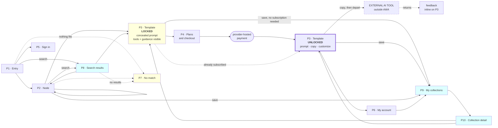

# 11 — Screen Design

**Product:** AWA — AI Creation Guide Platform
**Sources:** `docs/01-PROBLEM.md` … `docs/10-TECH-STACK.md`
**Scope:** Screens, states and interaction. No visual design, colour, typography or branding.
**Status:** Revised for the 44-feature launch scope. Voice input (FEAT-014) is excluded; search, filtering, collections and language selection (FEAT-003, 004, 005, 009, 039) are included

---

# Screen Inventory

**18 screens — 10 public, 8 administrative.** Up from 14: three public screens and one admin screen are new, appended after the existing set rather than inserted into it, so every screen that existed before keeps its ID.

| # | Screen | Features |
|---|---|---|
| **P1** | Entry | FEAT-001, 002, 006 |
| **P2** | Node — children and templates, any depth | FEAT-002, 004, 005, 008 |
| **P3** | Template — locked or unlocked | FEAT-008, 009, 010, 011, 013, 016, 017, 020, 022, 026, 028 |
| **P4** | Plans and checkout | FEAT-021, 023, 027, 042 |
| **P5** | Account and session | FEAT-025, 040 |
| **P6** | My account — subscription, allowance, prompts | FEAT-024, 026, 027 |
| **P7** | No match | FEAT-007 |
| **P8** | Search results | FEAT-003 |
| **P9** | My collections | FEAT-009 |
| **P10** | Collection detail | FEAT-009 |
| **A1** | Dashboard | FEAT-038, 043, 044 |
| **A2** | Catalog | FEAT-030 |
| **A3** | Template editor | FEAT-004, 031, 032, 035, 036, 039 |
| **A4** | Version history | FEAT-033 |
| **A5** | Tools and models | FEAT-034, 035 |
| **A6** | Users | FEAT-040, 041 |
| **A7** | Commerce | FEAT-042, 043 |
| **A8** | Languages | FEAT-039 |

**Public is mobile-first** (`NFR-008`). **Admin is desktop-first** — authoring long prompts, managing a tree and comparing versions is desk work.

**P3 is one screen with two entitlement states, not two screens.** The page is identical either way; only the prompt block differs. Splitting them would mean a navigation between seeing the product and paying for it, at exactly the moment the user is deciding.

**FEAT-014 (voice input) has no screen presence anywhere in this revision.** It is excluded from the 44-feature launch scope (`05-MVP §3.2`); every reference to a microphone or a spoken-input control in the previous revision of this document is removed, not disabled.

---

# A Persistent Element — Language Switcher

Not a screen. Present in the header on every public screen once more than one language is enabled (`08` API-032 returns the enabled set).

| | |
|---|---|
| **Components** | A control showing the current language; opens a short list of enabled languages |
| **Behaviour** | Selecting a language re-renders the current screen's content in it. Untranslated fields fall back to the default language silently — **never an empty string or a placeholder** (FEAT-039's acceptance criteria) |
| **At launch** | English is the only guaranteed language (`05-MVP §3.3`). **If no second language is enabled, this control does not render at all** — a switcher with one option is not a feature |
| **State** | Session-only at launch. `07 §2.2` treats the selection as re-selectable each visit, not stored against the account, though `user.preferred_language_id` exists if a later revision wants to remember it |

---

# P1 — Entry

**Purpose:** Say what AWA gives and what it does not, then route into the catalog.

| | |
|---|---|
| **Components** | One-line value statement · three labelled things: *a prompt · which tool · how to run it* · one plain line on what AWA does not do · subcategory list · **search field** (routes to P8) · sign-in link · no-match link |
| **Actions** | Enter a subcategory · search · sign in · report a missing need |
| **Loading** | Server-rendered. No spinner |
| **Error** | None reachable |
| **Empty** | Cannot occur — build fails without content |

**The boundary line is not marketing copy.** `UR-§14.3` records that believing AWA generates the image is the most likely misconception, and a user holding it will judge the product broken and ask for a refund.

**With one category at launch, P1 lists that category's subcategories directly.** A separate "all categories" screen would offer one choice. This splits when a second category ships.

---

# P2 — Node

**Purpose:** Narrow to a specific job and choose a template.

| | |
|---|---|
| **Components** | Breadcrumb · node name and description · child nodes · **filter controls** (attribute, model) · template cards · no-match link |
| **Template card** | Name · **what it produces** · which tools and models it targets · preview image · **Save** (opens the collection picker — FEAT-009) |
| **Actions** | Descend · ascend · open a template · **apply or clear a filter** · save a template · report a missing need |
| **Loading** | Server-rendered |
| **Error** | 404 → plain not-found with a route back |
| **Empty — no content** | A node with no children or templates → says the section is not ready, offers the parent and the no-match link |
| **Empty — filtered to nothing** | **Distinct from the above.** States plainly that the active filters match nothing, lists them, and offers to clear them (`08` V19). The node itself may still have templates — this is not the same message as an empty node |

**One screen type serves every depth.** A node at level 1 and level 5 render identically (`06 §3`).

**The prompt is not on the card.** The user chooses from the description alone — `UR-§13` records this as a known weak point, and P3's locked state is where it bites hardest.

## Filter controls

| Control | Feature | Behaviour |
|---|---|---|
| **Attribute filter** | FEAT-004 | One or more selections, all applied together (`04-FEATURES` — only templates matching *all* active filters are shown). **The specific attribute options offered here depend on `07 §4.3`'s taxonomy, which is REQUIRES PRODUCT DECISION** — this screen cannot be fully specified until that exists |
| **Model filter** | FEAT-005 | A single selection, narrowing to templates associated with that model, by direct assignment or inheritance. Withdrawn models are never offered |
| **Active filters** | Both | Shown as removable chips, individually — never a single "clear all" as the only way back |

**No search field on this screen.** Search (P8) looks across the whole catalog; these controls narrow the list already being viewed inside one node — `08 §3` draws this distinction deliberately, and blurring it here would reintroduce the ambiguity that document resolved.

---

# P3 — Template

**The screen the product lives on.** Two entitlement states.

## Reading order — mobile

```
1  Template name and what it produces
2  Boundary line — one sentence, BEFORE the prompt
3  THE PROMPT BLOCK          locked or unlocked
4  Tool cards, each with its reason
5  Guidance steps
   ─────────────────────
6  [on return] feedback
```

**The boundary line comes before the prompt.** If the prompt is first, a user skimming assumes this page produced it.

## State 1 — Locked (no subscription)

| | |
|---|---|
| **Prompt block** | Concealed, with the character count visible so the shape is real. **The text is absent from the response entirely** (`08` API-002, NFR-002) |
| **Above it** | What a subscription provides — and that **customization is metered separately** |
| **Action** | Subscribe → P4. **Save** is also available — FEAT-009 requires no subscription |
| **Also visible** | Tool cards with reasoning, and guidance, in full |

**Two things must be true here.** The concealed block must look like a real prompt, not an empty box — the user is judging the product by its shape. And the separate metering of customization must be stated *here*, not discovered later: `UR-§10 Scenario D` records the risk of a subscriber feeling charged twice.

**This is the conversion moment**, and `UR-§10 Scenario A` calls it the single most important untested screen in the product.

## State 2 — Unlocked (active subscription)

| Component | Behaviour |
|---|---|
| **Prompt block** | Full text, selectable |
| **Copy** | One action. Adjacent to the prompt, **and persistent at the bottom on mobile** while scrolling through tools and guidance. Explicit confirmation. Falls back to select-all if the clipboard is unavailable |
| **Customize** | Opens the panel below. Shows **remaining allowance** and **what this action costs** before it runs |
| **Save** | Opens the collection picker — create a new collection or add to an existing one. No subscription check |
| **Tool cards** | Name · one-line reason · free/paid · opens in a new tab. If the prompt has not been copied, an inline note says so — **warns, does not block** |
| **Guidance** | 4–7 numbered steps, collapsed by default on mobile |

**After a successful copy**, the persistent control changes to a hint pointing at the tools below — reinforcing copy-then-leave without a modal.

## The customize panel & context customization flow

The separate standalone Customize card has been removed from the detail page. Prompt customization is now integrated directly inside the **Context Prompt** tab:

| Aspect | Specification |
|---|---|
| **Location** | Inside the **Context Prompt** tab via a **Customize Context** button. The UI Prompt remains fixed and untouched |
| **Input** | A compact input box (Textarea) for user thoughts (product specs, target audience, brand tone) |
| **Execution** | **Apply Customization** deterministically combines the original Context Prompt blueprint with user thoughts. **Consumes 0 credits and makes no external AI calls** |
| **Dual Presentation** | Both the **Customized Version** (prominent card with `Copy Customized Prompt`, `Edit Thoughts`, `Reset`) and the **Original Version** (blueprint card with `Copy Original Prompt`) are clearly displayed |
| **Reset** | Tapping **Reset** clears the customization and returns immediately to the base context blueprint |
| **Credits & Errors** | Allowance credits (8 credits) and credit deduction error states (402, 422, 503) are preserved for standalone generative AI rewrites, not this direct client-side synthesis |

## Error states — for generative rewrites

| Condition | What the user sees |
|---|---|
| **402 allowance exhausted** | *"You're out of credits."* Buy credits → P4. **The prompt still works normally** |
| **422 unusable request** | *"Couldn't tell what to change — try naming the specific thing."* Prompt unchanged. **"No credit was used"** |
| **503 service unavailable** | *"Couldn't customize right now — no credit was used."* Retry offered. Prompt unchanged |
| **503 capacity paused** | *"Customization is temporarily paused. Try again shortly."* **No fault implied, no mention of budgets or caps** — the exact wording `05-MVP §3.3` fixes, and `08` API-004 already returns |
| 429 rate limited | *"Too many requests — try again shortly."* Corresponds to the decided limit of 20 per hour (`05-MVP §3.3`) — this message does not state the number |
| 401 session ended elsewhere | *"You were signed out because this account was used on another device."* Typed input preserved |
| 404 template hidden mid-session | *"No longer available"*, with sibling templates offered |

**Three of these are the product protecting the user from mechanisms built to protect the business.** They should be tested explicitly, not assumed: allowance exhausted must never block the prompt, a failed customization must say no credit was used, and a paused cap must not imply the user did something wrong.

## Feedback — on return

Revealed inline at the top when the tab regains focus after a recorded departure. **Not a modal** — FEAT-028 requires no interruption.

**One tap for one of exactly two outcomes — worked, or did not work** (`05-MVP §3.3`; `08` API-005 rule 11 accepts no third value). The comment field appears afterwards and stays optional. If the submission fails, the user is thanked anyway and the record is lost — they should not be made to manage our data collection.

---
# P4 — Plans and Checkout

**Purpose:** State the terms, take the payment.

| | |
|---|---|
| **Components** | Plan options with price and term · credit packs · **what each includes and excludes** · what happens at term end · proceed |
| **Actions** | Choose · proceed to the provider-hosted payment |
| **Loading** | Redirect to the provider |
| **Error** | Payment declined → returned with a plain message and the option to retry |
| **On return** | **Access may not be granted yet.** The webhook grants it (`08` API-010), which can lag the browser by seconds |

**The pending state matters.** A user who pays and sees a locked prompt will assume it failed. Show *"Confirming your payment…"* and poll `GET /me` rather than assuming entitlement on return.

**Subscription and credits must be distinguished here in words**, not left for the user to infer:

> *A subscription lets you read every prompt. Credits let you change them. You get 10 credits to start.*

**Prices are not specified on this screen** — credit pack sizes and the plan price both wait on the cost-per-customization measurement (`05-MVP §3.4`, **REQUIRES PRODUCT DECISION**). This screen's layout does not depend on the figures; its content does.

---

# P5 — Account and Session

Sign in · register · password reset. Conventional, with two specifics:

| Specific | Behaviour |
|---|---|
| **Signing in ends the other session** | Warn on the sign-in screen so the displaced device is not a surprise |
| Generic failures | No account enumeration on sign-in or reset |

Any in-progress work survives a sign-in prompt (`NFR-012`).

---

# P6 — My Account

**Purpose:** What they have, and what they made with it.

| | |
|---|---|
| **Components** | Subscription state and term end · **what happens at term end: prompts already delivered remain readable, no new deliveries or customizations** (decided, `05-MVP §3.3`) · allowance remaining · buy more · list of delivered prompts · **link to My Collections (P9)** |
| **Actions** | Open a past prompt · buy credits · open collections · sign out |
| **Empty** | No prompts yet → route back to the catalog |

**The prompts list exists because the user paid for them.** With no tab left open and no way back, a subscriber has lost what they bought (`08` API-017).

**Approaching term end**, a notice appears here and by email — FEAT-024 requires the user be informed *before* loss, and someone not visiting will not see an in-app notice.

**Collections do not require a subscription** (FEAT-009), so the link to P9 appears here regardless of subscription state — this page is not gated on entitlement, only on being signed in.

---

# P7 — No Match

**Not an edge case.** `UR-§11.2` records this as most likely at launch, and `05-MVP §6.1` calls the captured description the most valuable single piece of validation data.

| | |
|---|---|
| **Entry** | A persistent low-key link on P1 and every P2; prominent on an empty node or a filtered-to-nothing result |
| **Components** | A short acknowledgement · **one question: "What were you trying to make?"** · submit |
| **Captured silently** | Where in the catalog they were, and the visit reference |
| **Not asked** | Email, name, anything else |
| **After** | Thank them, say templates are being added, route back |

One question, not a form. Every extra field reduces completion.

---

# P8 — Search Results

**New this revision.** FEAT-003 — finds templates and categories across the whole catalog, not scoped to the node the visitor happens to be in.

| | |
|---|---|
| **Entry** | The search field on P1 or the persistent header |
| **Components** | The search term, editable in place · matching categories, each showing where it sits · matching templates, each showing **its position in the catalog** (`04-FEATURES` FEAT-003 acceptance criteria) and a **Save** button · result count |
| **Actions** | Open a matched category (→ P2) or template (→ P3) · refine the term · save a template directly from the result · report a missing need |
| **Loading** | Server-rendered from `08` API-031 |
| **Empty** | States plainly that nothing matched, and offers the no-match link (P7) — a search with zero results is itself a content-gap signal worth capturing, not just a dead end |
| **Hidden content** | Never appears, exactly as in every other catalog view |

**No dedicated search infrastructure sits behind this screen.** `06 §13` is explicit that a 20–30 template catalog is served by an indexed database query, not a search engine — this screen's simplicity is a direct reflection of that architectural decision, not a placeholder for something more elaborate later.

**Whether this screen gets used at all is an open validation question**, not an assumption: `05-MVP` V-I9 asks directly whether users search or filter at a catalog this small. This screen should be instrumented (`searched_or_filtered` in `07 §6.7`) from day one so that question has an answer.

---

# P9 — My Collections

**New this revision.** FEAT-009 — the list of collections a signed-in user has created. **No subscription required.**

| | |
|---|---|
| **Entry** | P6 My Account, or directly after using Save anywhere a template appears |
| **Components** | Each collection: name, count of templates · create-new control |
| **Actions** | Create a collection (name only) · open one (→ P10) · rename · delete |
| **Empty** | No collections yet → a short prompt to save something, with a link back to the catalog |
| **Delete confirmation** | States plainly that this removes the list, **not the templates themselves** — `features.md §4.5` is explicit that the templates stay exactly as saveable as before |

**Collections are private, with no sharing** (`features.md`) — nothing on this screen or P10 ever exposes another user's collections, and there is no share action to omit-by-oversight here.

---

# P10 — Collection Detail

**New this revision.** FEAT-009 — the templates inside one collection.

| | |
|---|---|
| **Components** | Collection name, editable · template cards, each opening the template (→ P3) |
| **Unavailable templates** | **Shown, not hidden** — `features.md §4.5` requires a saved template that is later hidden or withdrawn to remain visible in the collection, flagged unavailable, with a short explanation. It is never silently dropped |
| **Actions** | Remove one template from this collection (does not touch other collections it may also be in) · rename the collection · delete the collection |
| **Empty** | This specific collection has nothing saved yet → route back to the catalog |

**Opening an available template gives today's prompt, not the version that existed when it was saved.** `features.md` is explicit that this is deliberate — prompts get revised as models change, and a stale copy would defeat the point of saving something to return to.

---
# Administrative Screens

Desktop-first. Every write records who made it.

## A1 — Dashboard

| Panel | Why |
|---|---|
| **Content gaps** | Templates with no tool assigned, no guidance, or no published prompt; withdrawn tools still assigned (FEAT-038) |
| **Spend against the cap** | FEAT-043. **The number that stops a surprise invoice** |
| Usage and feedback summary | FEAT-044 |
| Recent unmet needs | Demand for content that does not exist |

**Spend and content gaps are the two panels that need to be visible without clicking.** Everything else can be a link.

## A2 — Catalog

Tree view. Create a node at any level, rename, reorder by drag, move a branch, hide.

| Behaviour | Detail |
|---|---|
| **Same form at every depth** | A subcategory is a category with a parent |
| **Hiding cascades** | Hiding a node hides everything beneath it — say so in the confirmation |
| **Deleting is deliberate** | Show the exact counts — *"3 subcategories, 24 templates"* — and offer **hide instead** as the default |
| Invalid move | A node cannot go beneath its own descendant. Rejected with a reason, nothing changes |

## A3 — Template Editor

Tabbed: **Details · Prompt · Tools · Guidance · Media · Attributes · Translations.** Two tabs added this revision.

| Tab | Contents |
|---|---|
| Details | Name, description, node, status |
| **Prompt** | The editor, a change note, and **Preview**. **Writes to the private database; publishing updates the public pointer only after the write succeeds** (`06 §5.4`) — invisible to the administrator as a two-step process, but worth knowing if a publish ever appears to hang |
| Tools | Assign tools and models; shows what is inherited from the parent and what overrides it |
| Guidance | Ordered steps; shows what is inherited |
| Media | Preview image, recorded guidance |
| **Attributes** *(new)* | Sets the `template_attribute` rows used by P2's filter controls (FEAT-004). **The specific attribute types offered here are REQUIRES PRODUCT DECISION** (`07 §4.3`) — this tab cannot be fully designed until that taxonomy exists |
| **Translations** *(new)* | For each enabled language (from A8), the translated `name` and `description`. Fields with no translation show the default-language value greyed, labelled as the fallback that users will see — never blank |

**Preview is the quality gate.** `UR-§8` records that quality risk sits entirely with the content team — there is no automated check before a prompt reaches a paying subscriber. Preview should be hard to skip, not a secondary button.

**Cannot publish without a prompt** (FEAT-031). The publish control is disabled with the reason stated, not silently absent.

**Inheritance must be visible.** An administrator assigning a tool needs to see that the parent already provides one, or they will duplicate it everywhere.

## A4 — Version History

| | |
|---|---|
| **Components** | Version list with date, author, change note · side-by-side diff · restore · feedback score per version |
| **Restore** | Creates a **new** version equal to the old one. The list grows; it does not rewind. Say so in the confirmation. **The same two-step private-then-public write as an ordinary publish** (`07` V17) |
| **Feedback per version** | Split by base and customized (`07 §6.5`) — otherwise the two contaminate each other |

**Showing feedback next to each version is what makes revision a decision rather than a guess.** It is the only place an administrator can see whether a rewrite helped.

## A5 — Tools and Models

List, add, edit, withdraw. Each tool carries the **reasoning line shown to users** — FEAT-016 requires every recommendation to have one.

Withdrawing shows how many assignments reference the tool before confirming.

## A6 — Users

| | |
|---|---|
| **Components** | List, search, subscription state, allowance balance |
| **Actions** | Change role, suspend, trigger password reset, **grant allowance, extend access** |
| **Adjustments** | Require a reason. Recorded with the actor (FEAT-041, NFR-016) |
| **Guard** | Cannot remove your own admin access; at least one administrator must remain |

Support adjustments exist because `UR-§10` describes foreseeable cases — a failed customization, a poor result, a session eviction — where the only sensible remedy is manual.

## A7 — Commerce

| | |
|---|---|
| **Plans and packs** | Name, price, term, initial allowance, availability. **Prices are REQUIRES PRODUCT DECISION** (`05-MVP §3.4`) until the cost-per-customization measurement exists — this screen should not be populated with guessed figures before then |
| **Payment configuration** | **Credentials are write-only** — once saved, never shown again. **Test connection before enabling** |
| **Spend cap** | The monthly ceiling, current spend, and the alert threshold. The rate limit itself (20 per user per hour) is decided and fixed (`05-MVP §3.3`) — not configurable from this screen, since nothing in `01–10` describes it as an administrator-adjustable value |

The test-connection step is small and prevents a typo reaching a real customer.

## A8 — Languages

**New this revision.** FEAT-039 — the languages available for selection, managed independently of any one piece of content.

| | |
|---|---|
| **Components** | List of languages: name, code, enabled state, default flag · add-a-language control |
| **Actions** | Add a language · enable or disable · **cannot disable the default language, and cannot have more or fewer than exactly one default** (`07` V19) |
| **What this screen does not do** | Enter translated content itself — that happens per entity, in that entity's own editor (A3's Translations tab is the template case; category and guidance follow the same pattern in their own editors). This screen only governs which languages exist and are selectable |

**English is the only language guaranteed to exist at launch** (`05-MVP §3.3`). This screen is where a second language would be added, and nothing about the product's other screens changes when that happens — the language switcher (above) simply has a second option to show.

---
# Screen Flow



**Three new nodes, shown in a different fill.** Search (P8) and collections (P9, P10) are the two genuinely new flows this revision adds; everything else is the same graph as before, with voice removed from inside P3 rather than from the diagram — it never had its own node.

---

# What This Design Omits

| Omitted | Excluded by |
|---|---|
| **Voice input, a microphone control** | **FEAT-014 excluded** (`05-MVP §3.2`). Present in the previous revision of this document; removed here, not merely undocumented |
| Prompt editing in place | FEAT-012 excluded — customization is the supported route |
| Share link, social sharing | Removed from the product |
| Category switcher | One category at launch |
| Onboarding tour | If the journey needs a tour, the journey is the problem |
| Requirement input form before the prompt | **The user types nothing until Customize.** The prompt is ready-made |
| **A like button or like count on any screen** | **Not built.** `features.md §4.4` describes one, but it carries no FEAT identifier and was never part of the decision that set the 44-feature scope (`07 §19.1`). **REQUIRES PRODUCT DECISION** before any screen in this document gains a like affordance — adding one silently would be building a feature nobody confirmed |
| Cookie or tracking consent banner | **Still undetermined**, and for a narrower reason than before: `05-MVP §3.3` decided *retention duration* (12 months) for user-submitted text, which is a different question from whether *visit tracking itself* (`interaction_event`, `visit_reference`) needs consent UI. Nothing in `01–10` resolves that second question. **REQUIRES PRODUCT DECISION** |

**Three rows that were here in the previous revision are gone because the features they excluded are now built, not because this design still omits them:** a search bar and filter panel (now P2 and P8), saved templates (now P9 and P10), and a language switcher (now the persistent element above). Listing a built feature as an omission would be the exact contradiction this update exists to fix.

---

# Assumptions

| # | Assumption | Test |
|---|---|---|
| A1 | The concealed prompt converts | `05-MVP` V-C3 — the conversion rate at P3 locked |
| A2 | The boundary line prevents the misconception | Show P1 for 30 seconds, ask what the product does |
| A3 | Description-only template choice is enough | Watch for users opening several templates in succession |
| ~~A4~~ | ~~Confirming transcribed text before spending is worth the extra tap~~ | **Not applicable.** FEAT-014 excluded — no transcription exists to confirm |
| A5 | Warning rather than blocking on depart-before-copy | Blocking would obstruct legitimate use |
| A6 | Guidance collapsed by default on mobile | If nobody expands it, that is a finding about guidance itself |
| A7 | Polling after checkout covers webhook lag | A user seeing a locked prompt after paying will assume failure |
| **A8** | **Users search or filter at all, at a 20–30 template catalog** | `05-MVP` V-I9 — instrument P2's filters and P8 from launch; a catalog this small may not need either in practice |
| **A9** | **Users save templates to collections, and return to them** | `05-MVP` V-I10 — instrument P9/P10 usage and repeat visits |
| **A10** | **A collection card list (P9) is enough; a saved template needs no note or tag from the user** | `features.md` describes naming the collection itself as the organisation method, nothing per-template. If users want to annotate why they saved something, this is where that gap would show up |

**A4 is struck through rather than removed**, the convention this document chain now uses consistently (`08` API-019, `09` U2/U9/U12) — retired in place so a reader who remembers it sees why, not a silently shortened list.

---

# Summary

**18 screens** — up from 14. P3 still carries the product and still has two entitlement states; three public screens and one admin screen are genuinely new.

**Five things that decide whether this works:**

**The boundary line sits before the prompt.** A user who believes AWA generates the image will ask for a refund.

**The copy control persists while scrolling.** One action, and it is the moment the product delivers what was paid for.

**Three error states protect the user from the business.** Allowance exhausted must never block the prompt. A failed customization must say no credit was used. A paused cap must not imply fault.

**The pending state after payment.** Entitlement comes from the webhook, not the browser. Show that you are confirming, and poll — otherwise a paying customer sees a locked prompt and concludes the payment failed.

**A saved template that later disappears is shown, not hidden.** P10's unavailable-but-visible treatment is the one place this design deliberately surfaces bad news rather than smoothing it over — `features.md` is explicit that silence here would leave a user wondering, which is worse than a short explanation.